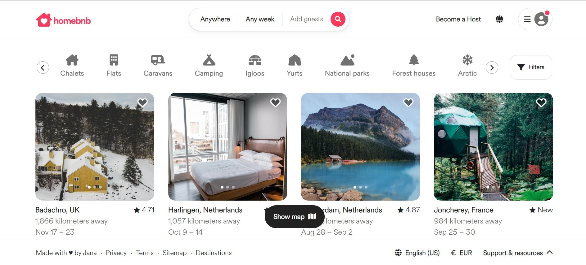

- [Overview](#overview)
  - [Screenshot](#screenshot)
  - [Links](#links)
- [My process](#my-process)
  - [Built with](#built-with)
  - [What I learned](#what-i-learned)
  - [Continued development](#continued-development)

### Overview

This is a clone Airbnb project for my portfolio. The focus of this project was to practice responsive web design with Bootstrap. I recreated the main Airbnb page using Boostrap elements and spacing as well as my own CSS and Javascript files.

### Screenshot

### Links

- Live Site URL: [https://gleeful-nasturtium-e0d13b.netlify.app/]

## My process

### Built with

- HTML
- CSS 
- JavaScript
- Bootstrap

### What I learned

I learned how to use Bootstrap navbar, containers, rows, columns, cards, carousels, spacing, etc. 

### Continued development

I want to learn more about JavaScript scroll events.
